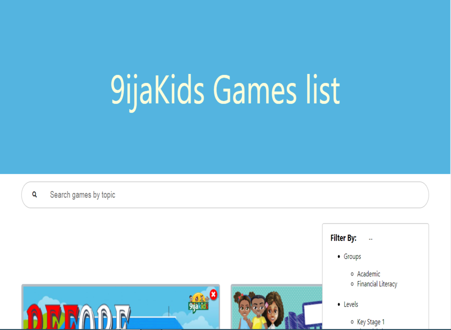

# 9ijaKids Games list - A game listing project built to demonstrate how to search and filter values in react.

## Table of contents

- [Overview](#overview)
  - [The challenge](#the-challenge)
  - [Screenshot](#screenshot)
  - [Links](#links)
- [My process](#my-process)
  - [Built with](#built-with)
- [Author](#author)

## Overview

### The challenge

Users should be able to:

- View all game list
- Search for game by their topics
- Filter game by category

### Screenshot

### Links

- Live Site URL: [9ijaKids Games list](https://9ijakids-game-list.vercel.app/)

## My process

### Built with

- CSS Grid
- Mobile-first workflow
- Javascript
- CSS
- Redux
- [React](https://reactjs.org/) - JS library
- [React-Spring](https://react-spring.io/)

## Author

- Website - [Emmanuel Ezeka](https://emmanuel-ezeka.netlify.app)
- Twitter - [@EECvision](https://twitter.com/EECvision)

